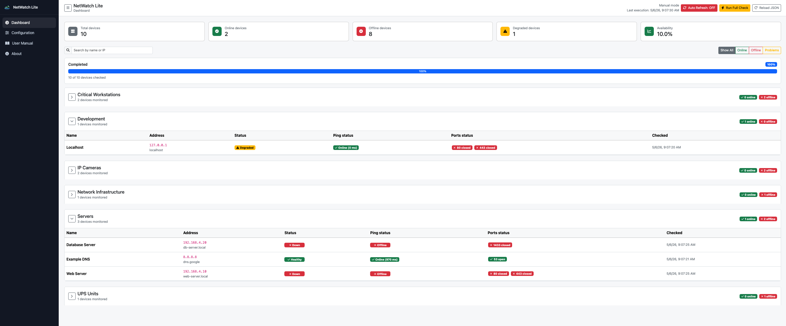
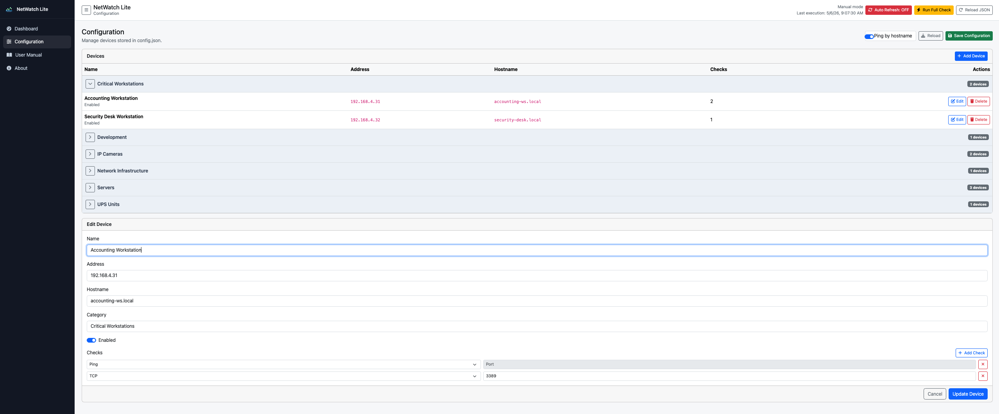

# NetWatch-Lite

NetWatch-Lite is a .NET 8 ASP.NET Core + Bootstrap network monitoring dashboard. It reads an editable JSON file, runs asynchronous ping and TCP checks, computes device health, groups results by category, and can be published as a portable Windows executable with the .NET runtime included.

Full visual documentation is available at [docs/index.html](docs/index.html).

Programmer documentation is available at [docs/developer-guide.md](docs/developer-guide.md).

Release notes and commit-level project history are summarized in [CHANGELOG.md](CHANGELOG.md).

GitHub repository: [https://github.com/dafermen/netwatch-lite](https://github.com/dafermen/netwatch-lite).

## Screenshots

### Dashboard



### Configuration



## Features

- Editable `config.json` inventory.
- Device categories such as `Servers`, `Critical Workstations`, `IP Cameras`, and `UPS Units`.
- Async ping checks with latency in milliseconds.
- Optional hostname-based ping mode for networks where IP addresses can change.
- Async TCP port checks.
- Parallel execution with `Task.WhenAll`.
- Global concurrency limit with `maxParallelChecks`.
- Aggregated status:
  - `Healthy`: ping success and all ports open.
  - `Degraded`: ping success but at least one port closed.
  - `Down`: ping failed.
- Dashboard summary metrics:
  - Total devices.
  - Online devices.
  - Offline devices.
  - Degraded devices.
  - Availability percentage.
- Search and client-side filters.
- Category groups collapsed by default.
- Hamburger sidebar navigation.
- Branded NetWatch Lite logo and favicon.
- Built-in User Manual and About pages.
- Responsive layout for desktop, tablet, and mobile screens.
- Configuration page at `/config`.
- CRUD UI for devices and checks stored in `config.json`.
- Configuration device table grouped by category for easier editing.
- Configuration category groups collapsed by default.
- Add/edit device form opens only when adding or editing a device.
- Manual mode by default.
- Optional auto refresh toggle that runs a full check every 60 seconds.
- Forced full check.
- Progressive dashboard rendering through Server-Sent Events while checks are still running.
- Visible monitoring progress with percentage, checked/total count, and completion state.
- JSON reload without restarting.

## Project Structure

```text
netwatch-lite/
├── Data/
│   └── config.json
├── Models/
│   ├── CategoryResult.cs
│   ├── CheckResult.cs
│   ├── DashboardSummary.cs
│   ├── Device.cs
│   ├── DeviceCheck.cs
│   ├── DeviceResult.cs
│   ├── DeviceStatus.cs
│   ├── MonitorConfiguration.cs
│   ├── MonitorResponse.cs
│   ├── MonitorStreamEvent.cs
│   └── MonitorSettings.cs
├── Services/
│   ├── JsonDeviceRepository.cs
│   ├── MonitorExecutionService.cs
│   ├── NetworkMonitorOptions.cs
│   └── NetworkMonitorService.cs
├── wwwroot/
│   ├── app.js
│   ├── index.html
│   ├── netwatch-lite.svg
│   └── styles.css
├── docs/
│   ├── developer-guide.md
│   └── index.html
├── appsettings.json
├── NetWatch.csproj
├── Program.cs
└── README.md
```

## Configuration

The device JSON path is configured in `appsettings.json`.

```json
{
  "NetworkMonitor": {
    "DeviceFilePath": "config.json"
  }
}
```

During local development, `Data/config.json` is copied to the build output as `config.json`. During portable publish, it is copied next to `NetWatch-Lite.exe`.

## Device JSON Format

```json
{
  "settings": {
    "intervalSeconds": 15,
    "timeoutMs": 1000,
    "maxParallelChecks": 50,
    "useHostnameForPing": false
  },
  "devices": [
    {
      "name": "Web Server",
      "ip": "192.168.4.10",
      "hostname": "web-server.local",
      "category": "Servers",
      "enabled": true,
      "checks": [
        { "type": "ping" },
        { "type": "tcp", "port": 80 },
        { "type": "tcp", "port": 443 }
      ]
    }
  ]
}
```

Use `category` to group devices in the UI. Use `enabled: false` to keep a device in the file without monitoring it. When `settings.useHostnameForPing` is `true`, ping checks use `hostname` when a device has one; otherwise they use `ip`. TCP checks continue to use `ip`.

## API Endpoints

| Method | Endpoint | Purpose |
|---|---|---|
| `GET` | `/api/devices` | Returns normalized devices from the loaded JSON. |
| `POST` | `/api/reload` | Reloads `config.json` from disk. |
| `GET` | `/api/config` | Returns the full editable configuration. |
| `POST` | `/api/config` | Saves the full configuration, creates `config.backup.json`, and reloads memory. |
| `GET` | `/api/results` | Backwards-compatible endpoint that forces a full check. |
| `POST` | `/api/monitor/run` | Forces a full check and prevents overlapping executions. |
| `GET` | `/api/monitor/stream` | Streams a full check progressively with `started`, `result`, `completed`, and `busy` events. |

## Version Notes

Changes are documented in [CHANGELOG.md](CHANGELOG.md). Each Git commit should keep a concise message describing the change, and user-facing changes should also be added to the changelog.

## Source Documentation

The C# source includes XML documentation comments for models and services. The frontend JavaScript includes JSDoc comments for dashboard rendering, filtering, backend calls, and execution controls.

The project also enables XML documentation generation in `NetWatch.csproj`:

```xml
<GenerateDocumentationFile>true</GenerateDocumentationFile>
```

## Build and Run

Install the .NET 8 SDK, then run:

```bash
dotnet restore
dotnet build
dotnet run
```

Open the URL printed by `dotnet run`, usually `http://localhost:5000`, `https://localhost:5001`, or another available local port.

## Create Windows Portable Build

Publish a self-contained Windows x64 package:

```bash
dotnet publish NetWatch.csproj -c Release -r win-x64 --self-contained true -p:PublishSingleFile=false -o publish/win-x64-portable
```

Expected output:

```text
publish/win-x64-portable/
├── NetWatch-Lite.exe
├── config.json
├── appsettings.json
├── wwwroot/
└── runtime dependencies...
```

Create a ZIP on macOS:

```bash
ditto -c -k --sequesterRsrc --keepParent publish/win-x64-portable publish/NetWatch-Lite-win-x64-portable.zip
```

To run on Windows:

```powershell
.\NetWatch-Lite.exe
```

Edit `config.json` in the same folder as `NetWatch-Lite.exe`, or use the `/config` page. Saving through the UI creates `config.backup.json`.

## Operational Notes

- `Run Full Check` executes all configured checks immediately.
- Dashboard startup and full checks stream results progressively, so devices appear as they finish instead of waiting for the whole execution.
- NetWatch Lite starts in manual mode by default.
- `Auto Refresh` runs a full check every 60 seconds after the operator turns it on.
- `settings.intervalSeconds` is retained for JSON compatibility but is not used by the current auto full-check timer.
- Invalid or corrupt `config.json` content is reported through the API/UI instead of crashing silently.
- `maxParallelChecks` should be adjusted carefully for large networks.
- TCP checks treat timeouts, refused connections, invalid targets, and unexpected socket failures as unavailable ports; they do not validate application protocol behavior.
- On small screens, wide device tables scroll horizontally while toolbars and forms stack vertically.
